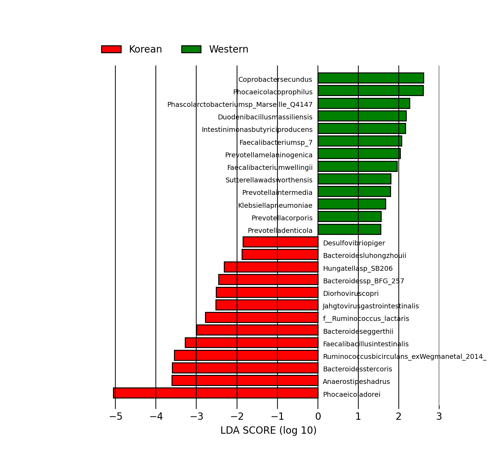

# Biomarker Discovery

To identify statistically significant microbial differences between the Korean High (KH) and Western High (WH) diet groups, we utilized **LEfSe** (Linear discriminant analysis Effect Size). This tool discovers biomarkers by characterizing the differences between biological classes.

## 1. Data Preparation
First, we consolidated the species-level abundance data generated by Bracken into a single matrix.

```bash
# Merge individual Bracken outputs into a single file
combine_bracken_outputs.py --files [KW]*.bracken -o all.bracken
```
Next, we extracted the necessary Name and Abundance columns to clean the dataset for downstream analysis

# Extract taxonomic names and abundance columns
```bash
bracken_num_columns=$(seq -s , 4 2 50)
cut -f 1,$bracken_num_columns all.bracken > all_num.bracken
```
To perform differential analysis, we assigned metadata labels defining our two dietary cohorts to the dataset

# Add Diet metadata labels (Korean vs. Western)

```bash
echo -e "Diet\tKorean\tKorean\tKorean\tKorean\tKorean\tKorean\tWestern\tWestern\tWestern\tWestern\tWestern\tWestern" > all_formatted.txt
tail -n +2 all_num.bracken >> all_formatted.txt
```

## 2.Statistical Analysis (LEfSe)

The formatted matrix was then processed through the LEfSe pipeline. We set the linear discriminant analysis (LDA) score threshold to 1.5 to highlight only the most significant biomarkers.

```bash
# Format the data for LEfSe
lefse_format_input.py all_formatted.txt all_num.lefse -c 1 -u 2 -o 1000000

# Run the LEfSe statistical analysis (LDA threshold: 1.5)
lefse_run.py all_num.lefse all_num.lefse.out -l 1.5

# Generate the biomarker bar chart
lefse_plot_res.py --dpi 200 --format png all_num.lefse.out biomarkers.png
```


## 3.Results & Visualizations

The LEfSe analysis successfully identified specific microbial clades that are differentially abundant between the two diets.
Differentially Abundant Taxa

The bar chart below displays the LDA scores of the identified biomarkers. Taxa pointing in one direction are significantly enriched in the Korean diet, while those pointing in the opposite direction are enriched in the Western diet.



(Figure 1: LEfSe results detailing the differentially abundant microbial taxa between the Korean and Western diet groups. The length of the bar represents a log10 transformed LDA score
