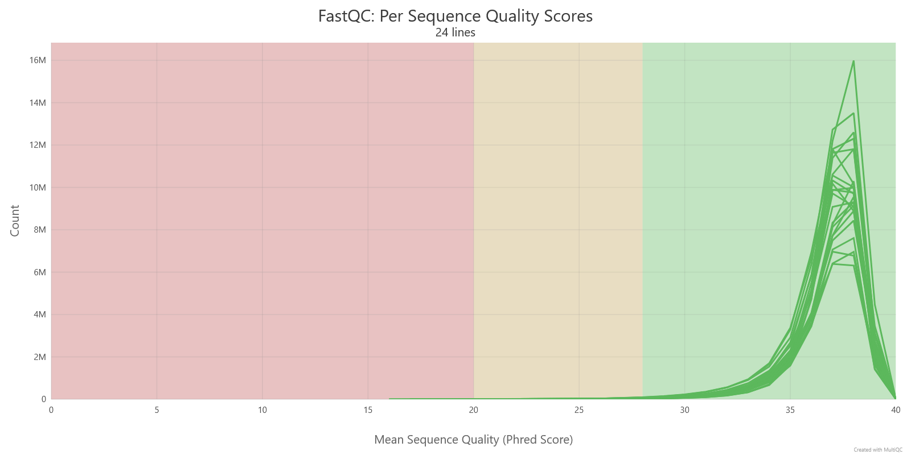

# Quality Control & Preprocessing

To ensure high-quality downstream analysis, raw FASTQ reads underwent rigorous quality assessment and filtering.

## 1. Initial Quality Assessment
First, we used **FastQC** to evaluate the quality of the raw reads, followed by **MultiQC** to aggregate the reports into a single interactive summary.

```bash
# Run FastQC on all reads
fastqc -t 3 -o fastqc_results *.fastq.gz

# Aggregate results using MultiQC
multiqc -o multiqc fastqc_results
```
The quality of raw reads was assessed using FastQC. The figure below shows the distribution of average quality scores per sequence across all 12 samples.



**Interpretation:**
As shown in the plot, the majority of sequences in all samples have a mean Phred quality score above 30, peaking at approximately 38. This indicates extremely high sequencing quality, ensuring that downstream taxonomic assignments are accurate.

## 2. Trimming and Filtering
Using TrimGalore, we removed low-quality bases (Phred score < 20) and Illumina adapters.

```bash
# Example command for trimming sample WH1B_089
trim_galore --paired --quality 20 --stringency 4 \
  ../1-data/R1_fastqc/WH1B_089_R1.fastq.gz \
  ../1-data/R2_fastqc/WH1B_089_R2.fastq.gz
```


Results:
Post-trimming MultiQC reports showed a significant increase in average Phred scores and successful removal of adapters across all 12 samples.

)


